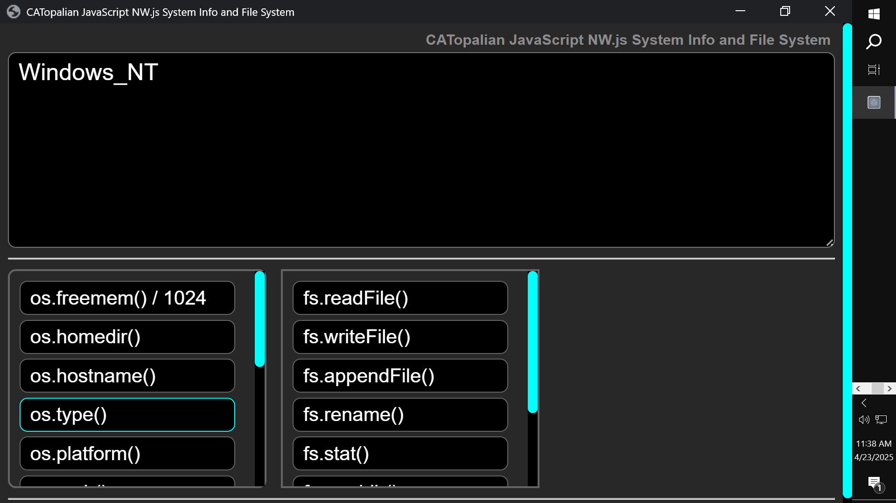

# CATopalian NWJS File and System Info
A JavaScript NW.js Node.js application that teaches System Info and File System functions of Node.js.

---

REQUIREMENTS:

NW.js  
https://nwjs.io/  

---

---

To run this application we:
* Download NW.js
* Extract All
* Find the nw.exe icon
* Drag the folder named **app** onto the **nw.exe** icon  

### [Video Instructions](app/src/tutorials/instructions.mp4)

---

### How to Download this App
1. Click the green Code Button on this github page
2. Choose Download ZIP
3. Save the Zip File
4. Extract All
5. Drag the folder named **app** onto the nw.exe icon 

---

Happy Scripting :-)

---

// Dedicated to God the Father  
// All Rights Reserved Christopher Andrew Topalian Copyright 2000-2026  
// https://github.com/ChristopherAndrewTopalian  
// https://github.com/ChristopherTopalian  
// https://sites.google.com/view/CollegeOfScripting

